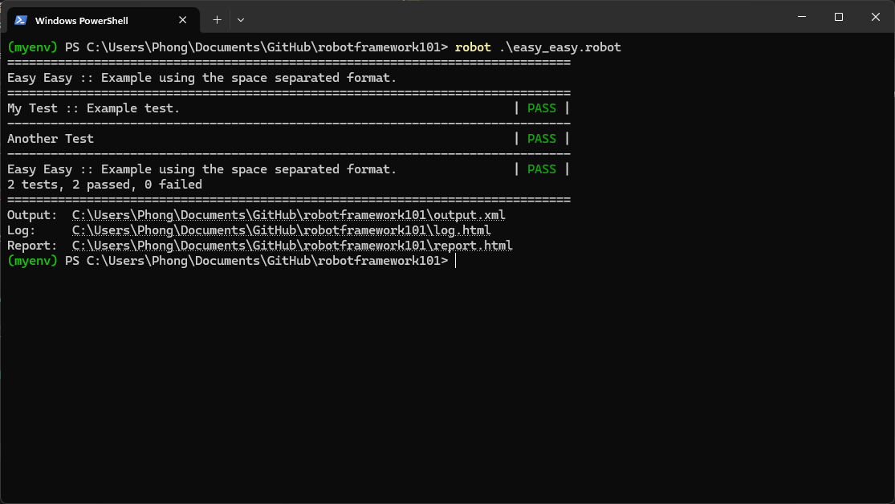

Robotframework101 Step-By-Step
===============
Set Environment & Install
---------------
ติดตั้ง python https://www.python.org/downloads/

#### Set Virtual Environment:
```powershell
python -m venv ${myenv} #ตั้งชื่ออะไรก็ได้
```
> เป็นคำสั่งที่ใช้สร้าง Virtual Environment (สภาพแวดล้อมเสมือน) ใน Python ซึ่งช่วยให้เราสามารถแยกแพ็กเกจและไลบรารีของแต่ละโปรเจกต์ออกจากกันได้

#### Activate:
```powershell 
myenv/Scripts/activate 
```
> เป็นสคริปต์ที่ใช้ เปิดใช้งาน Virtual Environment ที่สร้างขึ้นด้วย python -m venv บน Windows
>> ถ้าใช้ PowerShell แล้ว `Activate` ไม่ได้ ทำ Bypass ```Set-ExecutionPolicy -Scope Process -ExecutionPolicy Bypass``` ถ้ายังไม่ได้ `สวดมนต์ 😒` ไม่ก็ไปที Terminal อื่น

#### Install Requirements:
สร้าง ` requirements.txt ` สำหรับลง Lib ที่เกี่ยวกับ Robot Framework

```txt
invoke >= 0.20 # รันคำสั่งเชลล์ใน Python
rellu >= 0.6 # จัดการ release และ changelog สำหรับ Robot Framework
docutils >= 0.14 # ประมวลผลเอกสาร reStructuredText
robotframework >= 3.1.1 # เฟรมเวิร์กสำหรับการทดสอบอัตโนมัติ
robotframework-seleniumlibrary >= 3.3.1 # ใช้ Selenium ทดสอบเว็บใน Robot Framework
```

```powershell
pip install -r requirements.txt
```
> ใช้สำหรับติดตั้งแพ็กเกจ Python ทั้งหมดที่ระบุในไฟล์ `requirements.txt`
>> ตรวจสอบว่ามี pip ไหม `pip --version`

#### ลองทดสอบคำสั่ง Robot 
> อย่าลืม [Activate:](#activate) project ก่อน

```powershell
robot --version
```

Start testing
---------------
ไฟล์ `.robot` ใช้สำหรับเขียน สคริปต์การทดสอบอัตโนมัติ ด้วย Robot Framework ซึ่งเป็นเครื่องมือที่ใช้ภาษาแบบ Keyword-Driven สำหรับการทดสอบระบบต่าง ๆ

สร้างไฟล์ทดสอบ `easy_easy.robot` ในโปรเจค 🫠
```robot
*** Settings ***
Documentation     Example using the space separated format. 
# อธิบายถึงการทำงานของไฟล์หรือส่วนต่างๆ โดยทั่วไปแล้วจะอธิบายว่าระบบนี้ทำอะไร
Library           OperatingSystem 
# การนำเข้าไลบรารีที่ใช้ในการทำงาน OperatingSystem เกี่ยวกับระบบปฏิบัติการ เช่น การตรวจสอบหรือทำงานกับไฟล์และไดเรกทอรี


*** Variables ***
${MESSAGE}        Hello, world!

*** Test Cases ***
My Test 
# My Test ชื่อของชุดทดสอบนี้
    [Documentation]    Example test.
    # [Documentation]    Example test. ใช้ในการอธิบายถึงการทดสอบนี้
    Log    ${MESSAGE} 
    # Log ${MESSAGE}: คำสั่งให้พิมพ์ข้อความจากตัวแปร ${MESSAGE} ซึ่งจะพิมพ์ว่า "Hello, world!"
    My Keyword    ${CURDIR} 
    # My Keyword ${CURDIR}: เรียกใช้คีย์เวิร์ด My Keyword และส่งพารามิเตอร์ ${CURDIR} ซึ่งเป็นตัวแปรที่เก็บเส้นทางของไดเรกทอรีปัจจุบัน

Another Test
# Another Test ชื่อของชุดทดสอบนี้
    Should Be Equal    ${MESSAGE}    Hello, world! 
    # Should Be Equal ${MESSAGE} Hello, world!: ตรวจสอบว่า ${MESSAGE} มีค่าตรงกับ "Hello, world!" หรือไม่ ถ้าไม่ตรงจะล้มเหลว

*** Keywords ***
My Keyword
    [Arguments]    ${path} 
    # [Arguments]: กำหนดพารามิเตอร์ที่คีย์เวิร์ดนี้จะรับ ซึ่งในที่นี้รับพารามิเตอร์ ${path}
    Directory Should Exist    ${path} 
    # Directory Should Exist ${path}: คำสั่งที่ตรวจสอบว่าไดเรกทอรีที่กำหนดใน ${path} มีอยู่จริงหรือไม่ ถ้าไม่ตรงจะล้มเหลว
```
#### Run Test
```powershell 
robot easy_easy.robot
```

